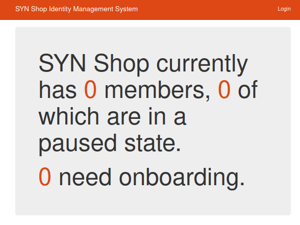
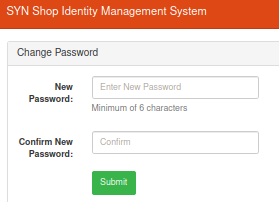

## Introduction
Over the past several years, the [SYN Shop hacker/makerspace](https://www.synshop.org) has grown to a size where validating membership is no longer via a first-name basis.  The shop was in need of something more robust, automated and easy to use.  

Some of the features included are:

- Membership Status Tracking
- Contact Information / Emergency Contact Tracking
- Real-time Payment Processor Information (via Stripe) to show payment / subscription status
- Shop Liability Waiver (scanned document) Management

## Setup (Development)

1. Requirements
    * Python 3.10.x
    * MySQL
    * NGINX

   For Ubuntu, this looks like:
   
       apt-get install python3-dev python3.10-venv mysql-server build-essential \
             python3-pip libmysqlclient-dev git gh nginx libffi-dev apache2-utils

2. Set up a [python virtual environment](http://docs.python-guide.org/en/latest/dev/virtualenvs/), clone or download the source for ShopIdentifyer and pip install the requirements.txt file included:

       git clone git@github.com:synshop/ShopIdentifyer.git
       python3 -m venv ShopIdentifyer/.venv/
       source ./ShopIdentifyer/.venv/bin/activate
       cd ShopIdentifyer
       pip install -r requirements.txt

3. Assuming your MySQL database is secure (`sudo mysql_secure_installation` is a great start), using a privileged MySQL user (aka `root`) create a `synshop` MySQL user with a good password. In this example use the insecure password of `CHANGEME`:
   
       CREATE USER 'synshop'@'localhost' IDENTIFIED BY 'CHANGEME';

4. Now we need to create the app database, grant access to it and create all the tables.  Assuming your privileged user is `root`, run 

       mysql -u root -p  < sql/create.sql

6. To get started, copy the `config.dist.py` file to `config.py` in the `identify` folder. Modify it to have the specific values for your environment (see below about  `ENCRYPTED_` values). In this example all ciphertexts (encrypted values) are `CHANGEME` and have been encrypted with the password also of `CHANGEME`:

       ENCRYPTED_STRIPE_TOKEN = 'aSy9t6N2sxEDN+WzPyXKVA=='
       ENCRYPTED_DATABASE_PASSWORD = 'aSy9t6N2sxEDN+WzPyXKVA=='
       ENCRYPTED_MAIL_USERNAME = 'aSy9t6N2sxEDN+WzPyXKVA=='
       ENCRYPTED_MAIL_PASSWORD = 'aSy9t6N2sxEDN+WzPyXKVA=='

       ENCRYPTED_SMTP_USERNAME = 'aSy9t6N2sxEDN+WzPyXKVA=='
       ENCRYPTED_SMTP_PASSWORD = 'aSy9t6N2sxEDN+WzPyXKVA=='

       ENCRYPTED_DISCORD_BOT_TOKEN = 'aSy9t6N2sxEDN+WzPyXKVA=='
       DISCORD_MANAGE_ROLES = False
       DISCORD_GUILD_ID = 'foo'
       DISCORD_ROLE_PAID_MEMBER = 'foo'
       DISCORD_ROLE_VETTED_MEMBER = 'foo'

       ENCRYPTED_SESSION_KEY = 'aSy9t6N2sxEDN+WzPyXKVA=='
       ENCRYPTED_ADMIN_PASSPHRASE = "aSy9t6N2sxEDN+WzPyXKVA=="

       SMTP_SERVER = 'foo.com'
       SMTP_PORT = 587

       DATABASE_USER = 'synshop'
       DATABASE_HOST = 'localhost'
       DATABASE_PORT = 3306
       DATABASE_SCHEMA = "shopidentifyer"

       LOG_FILE = "/tmp/gunicorn.log"

       SCHEDULER_ENABLED = False

       STRIPE_CACHE_REFRESH_MINUTES = 60
       STRIPE_CACHE_REBUILD_MINUTES = 1440
       STRIPE_CACHE_REBUILD_CRON = '46 23 * * *'
       STRIPE_CACHE_REFRESH_CRON = '15 * * * *'
       STRIPE_CACHE_REFRESH_REACHBACK_MIN = 15
       STRIPE_CACHE_DEACTIVATE_CRON = '55 23 * * *'
       STRIPE_FETCH_REALTIME_UPDATES = False  # False means no emails sent during swipes

       MAIL_SERVER = 'localhost'
       MAIL_PORT = 22
       MAIL_USE_TLS = True
       MAIL_USE_SSL = False
       MAIL_DEBUG = True

       ACCESS_CONTROL_HOSTNAME = 'localhost'
       ACCESS_CONTROL_SSH_PORT = 22

7. You're now ready to start your local dev instance. When prompted for `Please enter the enryption key`, use `CHANGEME`:

       ./localserver.py 

You can access the server at http://localhost:8000 and it should look like this:



### Adding admin users

In order to log into the system as an admin you need to have an entry in the `members` and the `admin_users` table for your user.  Here's how to set up your first user:

1. Create a bcrypt hash of your password.  This is the hash for `changeme` using the `htpasswd` util we installed during setup (the `USER` input is discarded):

       htpasswd -nbBC 10 USER changeme |cut -f2 -d:
       $2y$12$anHyBEtJbDrpSg1sEtgGa.vya.v2aqTu8V.eu624MGn5Umy2v9qse

2. We can create the two records needed then with this sql:
   ```sql
   insert into shopidentifyer.admin_users values ('test_stripe_id','$2y$12$anHyBEtJbDrpSg1sEtgGa.vya.v2aqTu8V.eu624MGn5Umy2v9qse');
   insert into shopidentifyer.members values ('test_stripe_id', 'test_drupal_id', 'N/A', 
       'ACTIVE', 'VETTED', 'the first user', 'first_admin', NULL, NULL, NULL, NULL, NULL, 
       NULL, NULL, NULL, NULL, NULL, NOW(), NOW()  );
   ```
   
3. Set this user to have a secure password by logging in with username `first_admin` and password `changeme` at http://localhost:8000 and then going to http://localhost:8000/admin/changepassword/test_stripe_id . You should see a change password screen: 

   

### Encrypted values

Please note that all of the properties starting with `ENCRYPTED_` are encrypted.  When the application starts up, it will prompt you for a single decryption password.  This is the same password that you will use to encrypt the properties using the cli tool `./identity/crypto/encrypt` and `./identity/crypto/decrypt`.

In order for the decryption to work, you need to use the same password to encrypt all of the 6 values. Here's an example of encrypting the string `foo` with the password of also `foo`:

    python3 identity/crypto/encrypt
    Please enter the encryption key:
    Please enter the plaintext you wish to encrypt:
    Encrypted Value: aSy9t6N2sxEDN+WzPyXKVA==

So, if you wanted `foo` to be the value for the `ENCRYPTED_DATABASE_PASSWORD` you would define it like this in `config.py`:

    ENCRYPTED_DATABASE_PASSWORD = 'aSy9t6N2sxEDN+WzPyXKVA=='

If you need to decrypt, it's the same process, but in reverse:

    python3 ./identity/crypto/decrypt
    Please enter the decryption key: 
    Please enter the ciphertext you wish to decrypt: 
    Plaintext Value: foo

Again, you need to use the same password for each of the 6 encrypted strings in your config file.

## Setup (Production)

In addition to all the development steps above, you'll need to do the steps in this section.

### NGINX Configuration

You'll need to set up SSL/TLS to do development, since all the Flask routes are designed to use SSL.  The development instance is already configured to use an ad-hoc SSL generation mechanism when you start the application using `./localserver.py`, but there is more work involved to set a production instance that uses Gunicorn.  You'll need to set up a HTTP server (we choose NGINX) to terminate the SSL requests and proxy them to the Gunicorn container.  There is a very basic NGINX configuration in `nginx/default` that you should be able to use out of the box or without many changes.  You will need to provide a SSL certificate but there are many solutions available on the internet.

### Starting, Stopping and Debugging

In a production environment, you'll need to launch the application using Gunicorn:

    ./start_gunicorn.sh

When you run this command, you'll some output similar to this:

    ./start_gunicorn.sh  
    Please enter the startup password and press [enter]:

    Showing application status:
    mrjones   9389  0.2  0.0  17352  2280 pts/9    S+   22:07   0:00 /bin/bash ./start_gunicorn.sh
    mrjones   9411  0.0  0.1  50584 11848 ?       R    22:07   0:00 /home/mrjones/Envs/ShopIdentifyer/bin/python /home/mrjones/Envs/ShopIdentifyer/bin/gunicorn --bind 127.0.0.1:8000 -D --log-file /tmp/gunicorn.log runserver:app
    mrjones   9413  0.0  0.0  15936   936 pts/9    S+   22:07   0:00 grep -i gunicorn

If you need to look at the log to see why something isn't working, the logs are in `/tmp/gunicorn.log`    

